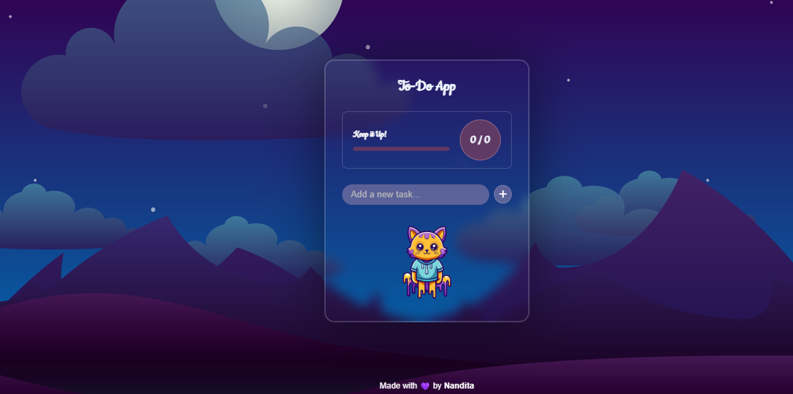

# 🌙 To-Do App — Purple Theme

This is a beautifully themed To-Do List App built using **HTML**, **CSS**, and **JavaScript**. It includes features like:

- Task creation, editing, and deletion
- Persistent storage using `localStorage`
- Confetti celebration on task completion 🎉
- Progress tracking with a visual bar
- Custom styling and responsive design
- Cute animated visuals and a sticky footer

---

## 🔗 Live Demo

👉 [Click to View the App](https://nanditasarwate.github.io/Todo-App--Purple-/)

---

## 📸 Preview



---

## 💻 How to Run Locally
 Clone the repo:
   ```bash
   git clone https://github.com/Nanditasarwate/Todo-App--Purple-.git
